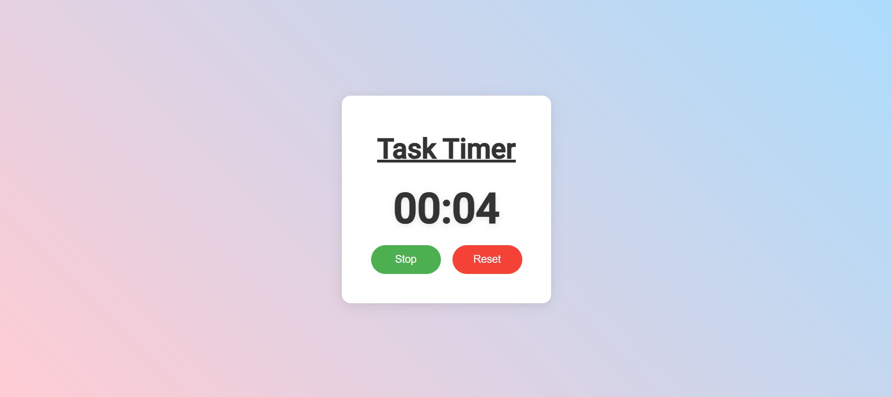

# Task Timer

A simple **Task Timer** web application built using **HTML**, **CSS**, and **JavaScript**. This app helps users track the time spent on tasks by providing a straightforward timer interface with start, stop, and reset functionality.

## Features
- **Start/Stop Timer**: Click the button to start or stop the timer.
- **Reset Timer**: Resets the timer to 00:00.
- **Modern Design**: Clean, modern user interface.
- **Responsive**: Works on both desktop and mobile devices.
- **Timer Display**: Shows time in minutes and seconds.

## Technologies Used
- **HTML**: Structure of the app and content layout.
- **CSS**: Styling and layout of the application.
- **JavaScript**: Timer functionality and event handling.

## Usage
1. Open the app by launching the `index.html` file in your browser.
2. Click on the **Start** button to begin the timer. It will display the time in the format `MM:SS`.
3. Click **Stop** to pause the timer, and click **Start** again to resume.
4. Click **Reset** to reset the timer back to `00:00`.

## Screenshots
  
_Screenshot of the Task Timer app running in a browser._

## Contributing
We welcome contributions to the Task Timer project! To contribute:
1. Fork the repository
2. Create a new branch (`git checkout -b feature-name`)
3. Commit your changes (`git commit -am 'Add feature'`)
4. Push to the branch (`git push origin feature-name`)
5. Open a pull request

Feel free to submit issues or pull requests to improve the app.

---
Your time starts now!
